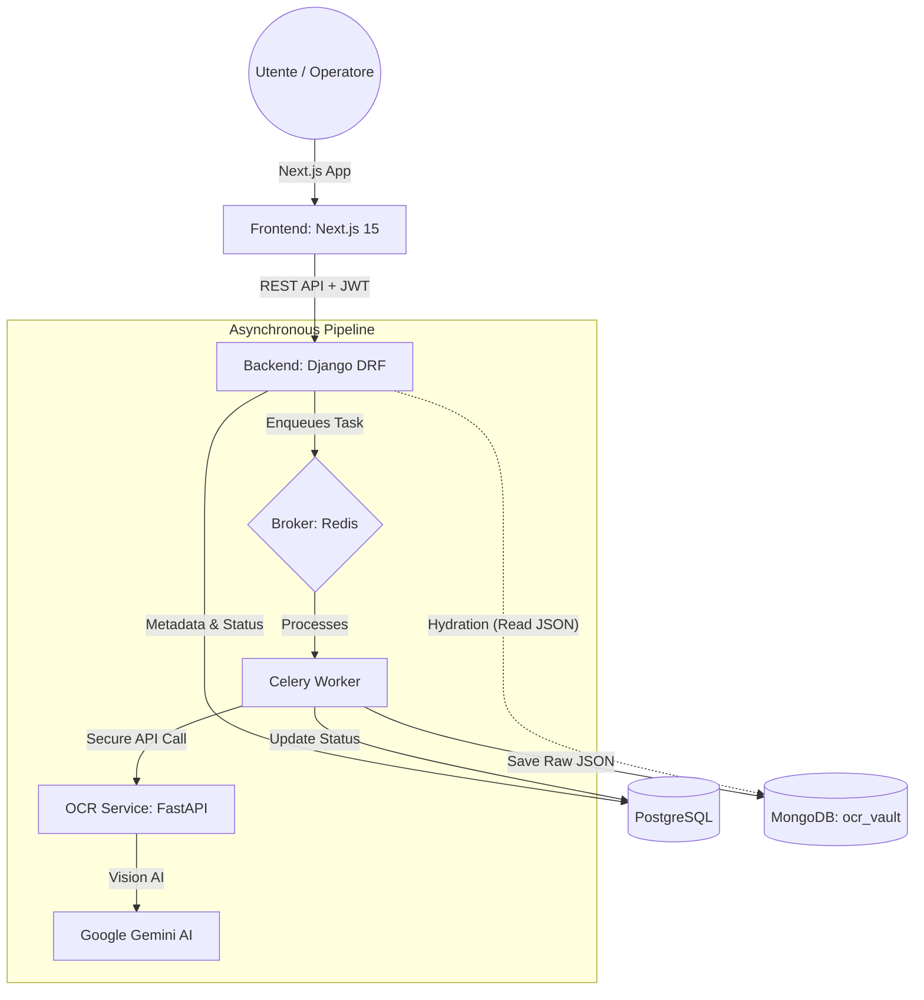

# 🚀 AI-Invoice Hub: Enterprise AI Accounting Platform

**AI-Invoice Hub** è una soluzione SaaS di livello enterprise progettata per automatizzare l'estrazione e la gestione dei dati da fatture e documenti commerciali. Utilizzando modelli di visione artificiale di ultima generazione (**Google Gemini 1.5 Flash**), la piattaforma trasforma immagini grezze in dati strutturati con precisione chirurgica, ottimizzando i flussi contabili aziendali.

---

## 🏗️ Architettura del Sistema (Advanced Microservices)

La piattaforma è costruita su un'architettura a **microservizi disaccoppiati**, garantendo scalabilità orizzontale e resilienza. Ogni componente gira nel proprio container Docker.



### 🧠 Dettaglio Componenti (Polyglot Persistence)
1.  **Frontend (Next.js 15 + Tailwind):** Interfaccia High-Density per massimizzare l'efficienza degli operatori. Gestisce sessioni sicure, polling dinamico e implementa **Ghost Loading** (Skeleton UI) per transizioni fluide.
2.  **Core Backend (Django 4.2):** L'orchestratore centrale. Gestisce logica di business, sicurezza JWT e utilizza il pattern di **Hydration** per interrogare MongoDB solo on-demand.
3.  **Task Engine (Celery + Redis):** Gestisce il processamento OCR in background. Implementa retry intelligenti e procedure "Fail-Fast" per limitazioni API (Rate Limit).
4.  **OCR AI Engine (FastAPI):** Microservizio bridge isolato per la logica di visione, centralizzando la gestione tipizzata degli errori HTTP (429/500).
5.  **Relational Database (PostgreSQL):** Conservazione sicura (ACID) di anagrafiche utente, metadati e puntatori logici (ID) ai documenti esterni.
6.  **NoSQL Vault (MongoDB):** Storage Documentale isolato ad alte prestazioni, accessibile solo via credenziali ridotte (`ocr_user`), dedicato al salvataggio massivo dei payload JSON dell'OCR.

---

## ✨ Funzionalità Principali

### 📤 Centro di Caricamento Intelligente
- **Live Image Preview:** Visualizzazione istantanea del documento tramite `URL.createObjectURL`.
- **Async Processing:** L'utente può caricare più fatture e continuare a lavorare mentre il sistema le elabora in background.

### 🗃️ Vault Contabile (Archivio)
- **High-Density Data Tables:** Viste compatte per visualizzare centinaia di record in una singola schermata.
- **Dynamic Status Chips:** Barra di filtraggio interattiva in tempo reale per stato (In Coda, Completati, Falliti), integrata a pieno col Database.
- **Ghost Loading (Skeleton UI):** Esperienza d'attesa Premium ("Granular Shimmer") che mantiene intatto il layout della pagina, animando il corpo della tabella a 60fps per azzerare sfarfallamenti visivi (CLS mitigato).

### 👮 Console di Amministrazione (Radar Control)
- **User Management:** Monitoraggio totale degli operatori registrati.
- **Deep Inspection:** Possibilità per l'Admin di visionare l'archivio di ogni utente per verificare la conformità dei caricamenti.

---

## 📂 Struttura del Progetto

```text
ocr_project/
├── .env                # Configurazione UNIFICATA (Root)
├── docker-compose.yml  # Orchestrazione Multi-Container
├── mongodb/            # Configurazione Vault NoSQL
│   └── init-mongo.js   # Script Hardening: Ruoli e privilegi (Least Privilege)
├── backend/            # Django Core (Modelli, API, Auth)
│   ├── api/            # Logica Documenti, Tasks Celery & Test
│   │   ├── tasks.py    # Logica di resilienza OCR (Celery)
│   │   └── tests.py    # Suite di test Backend
│   └── core/           # Impostazioni & Celery App
├── frontend/           # Next.js 15 App (Interfaccia Utente)
│   ├── src/app/        # Rotte (Dashboard, Admin, Auth)
│   ├── src/lib/api.ts  # Networking dinamico (Docker/Local)
│   └── src/types/      # Definizioni TypeScript (NextAuth)
├── ocr_service/        # FastAPI Service (Integration Gemini AI)
│   ├── main.py         # Motore OCR & Sonda Modelli
│   └── tests/          # Suite di test OCR
└── README.md           # Questa documentazione
```

---

## 🛡️ Resilience & Security (Professional Hardening)

### 👮 Sicurezza di Livello Bancario
- **JWT Token Rotation**: Implementata la rotazione dei Refresh Token per prevenire furti di sessione.
- **Silent Refresh**: La sessione si rinnova automaticamente in background (Sliding Window), garantendo un'esperienza fluida.
- **Internal Secret Protection**: Comunicazione Backend-OCR protetta da header `X-Internal-Secret`.

### 🛡️ Polyglot Hardening (Sicurezza Dati Ibrida)
- **Least Privilege NoSQL:** MongoDB è inizializzato con uno script isolato (`init-mongo.js`) che crea un'utenza dedicata (`ocr_user`) blindata al solo database `ocr_vault` ("readWrite").
- **Network Isolation:** La porta interna di MongoDB (27017) NON è esposta all'host docker; vive irraggiungibile nella rete interna privata.
- **Ownership Verification (Cross-Check):** L'API Django, in fase di estrazione dati NoSQL ("Hydration"), applica un check crittografico validando che il campo `user_id` del JSON Mongo coincida strettamente col token JWT autenticato (Previene ID Guessing).

### ⚙️ Tolleranza ai Guasti & Integrità Relazionale
- **Atomic Cleanup (Signals):** Trigger asincrono (Post Delete); l'eliminazione di un documento Postgres innesca la rimozione atomica e simultanea della foto residente su disco e del JSON "pesante" parcheggiato in MongoDB, scongiurando dati orfani.
- **Intelligent Fail-Fast su Rate Limit:** Il layer Celery intercetta le Quote Esaurite di Gemini ("429 Too Many Requests") tranciando immediatamente i retries e declassando la fattura a "FAILED", preservando code di calcolo ed evitando all'utente loop di caricamento infiniti.

### 🧪 Suite di Test
- **Pytest Suite**: Oltre 30 test automatizzati verificano l'isolamento dei dati, l'autenticazione e la logica asincrona dei task.

---

## 🛠️ Guida all'Installazione e Setup

### 1. Prerequisiti
- Docker & Docker Compose installati sul proprio OS.

### 2. Configurazione Variabili d'Ambiente
Il progetto usa un file `.env` unico nella root. Docker Compose lo legge automaticamente per tutti i servizi.

1.  **Copia il template:** Duplica `env.template` in `.env`:
    ```bash
    cp env.template .env
    ```
2.  **Configura i segreti:** Apri `.env` e inserisci la tua `GEMINI_API_KEY` (da [Google AI Studio](https://aistudio.google.com/)).

### 3. Avvio
```bash
docker-compose up --build -d
```

### 4. Creazione Account Admin
```bash
docker-compose exec backend python manage.py migrate
docker-compose exec backend python manage.py createsuperuser
```

### 5. Accesso alla Piattaforma
- **Pannello Utente:** [http://localhost:3000](http://localhost:3000)
- **API Backend:** [http://localhost:8000](http://localhost:8000)
- **Interfaccia OCR:** [http://localhost:8001](http://localhost:8001)

---
*Manuale Tecnico Aggiornato al 30 Marzo 2026*
