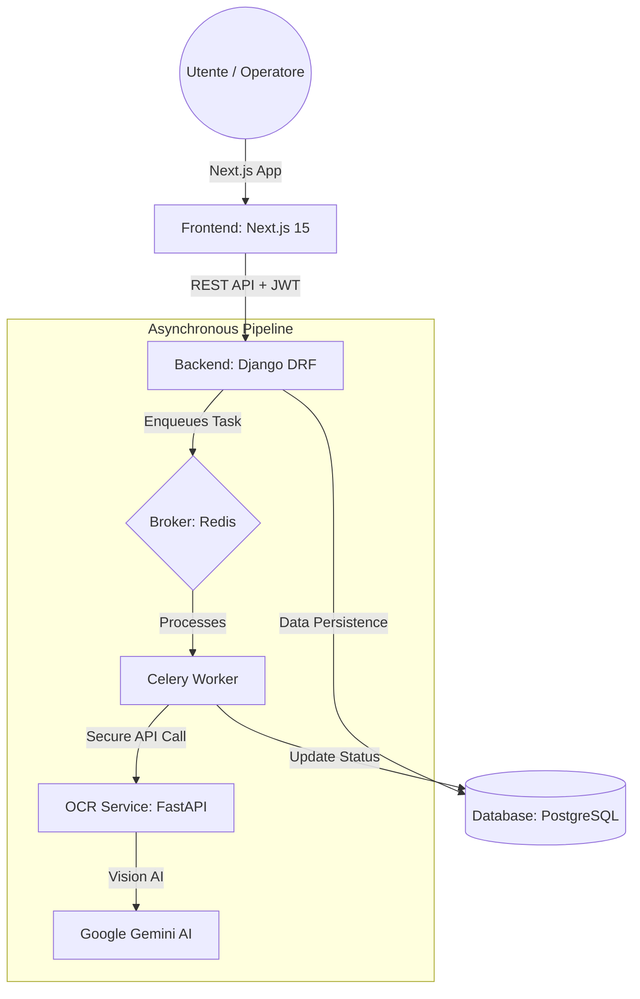

# 🚀 AI-Invoice Hub: Enterprise AI Accounting Platform

**AI-Invoice Hub** è una soluzione SaaS di livello enterprise progettata per automatizzare l'estrazione e la gestione dei dati da fatture e documenti commerciali. Utilizzando modelli di visione artificiale di ultima generazione (**Google Gemini 1.5 Flash**), la piattaforma trasforma immagini grezze in dati strutturati con precisione chirurgica, ottimizzando i flussi contabili aziendali.

---

## 🏗️ Architettura del Sistema (Advanced Microservices)

La piattaforma è costruita su un'architettura a **microservizi disaccoppiati**, garantendo scalabilità orizzontale e resilienza. Ogni componente gira nel proprio container Docker.



### 🧠 Dettaglio Componenti
1.  **Frontend (Next.js 15 + Tailwind):** Interfaccia High-Density per massimizzare l'efficienza degli operatori. Gestisce sessioni sicure e polling dinamico.
2.  **Core Backend (Django 4.2):** L'orchestratore centrale. Gestisce la logica di business, la sicurezza JWT e le migrazioni del database.
3.  **Task Engine (Celery + Redis):** Gestisce il processamento OCR in background, permettendo alla UI di rimanere fluida e reattiva.
4.  **OCR AI Engine (FastAPI):** Microservizio bridge dedicato esclusivamente all'integrazione AI, isolando la logica di visione artificiale dal core.
5.  **Persistence Layer (PostgreSQL):** Database relazionale di classe enterprise per la conservazione sicura di anagrafiche, metadati e risultati OCR.

---

## ✨ Funzionalità Principali

### 📤 Centro di Caricamento Intelligente
- **Live Image Preview:** Visualizzazione istantanea del documento tramite `URL.createObjectURL`.
- **Async Processing:** L'utente può caricare più fatture e continuare a lavorare mentre il sistema le elabora in background.

### 🗃️ Vault Contabile (Archivio)
- **High-Density Data Tables:** Viste compatte che permettono di visualizzare centinaia di record in una singola schermata.
- **Status Badges:** Indicatori cromatici istantanei sulla validità dei documenti e sullo stato della scansione (PROCESSING, COMPLETED, FAILED).

### 👮 Console di Amministrazione (Radar Control)
- **User Management:** Monitoraggio totale degli operatori registrati.
- **Deep Inspection:** Possibilità per l'Admin di visionare l'archivio di ogni utente per verificare la conformità dei caricamenti.

---

## 📂 Struttura del Progetto

```text
ocr_project/
├── .env                # Configurazione UNIFICATA (Root)
├── docker-compose.yml  # Orchestrazione Multi-Container
├── backend/            # Django Core (Modelli, API, Auth)
│   ├── api/            # Logica Documenti, Tasks Celery & Test
│   │   ├── tasks.py    # Logica di resilienza OCR (Celery)
│   │   └── tests.py    # Suite di test Backend
│   └── core/           # Impostazioni & Celery App
├── frontend/           # Next.js 15 App (Interfaccia Utente)
│   ├── src/app/        # Rotte (Dashboard, Admin, Auth)
│   ├── src/lib/api.ts  # Networking dinamico (Docker/Local)
│   └── src/types/      # Definizioni TypeScript (NextAuth)
├── ocr_service/        # FastAPI Service (Integration Gemini AI)
│   ├── main.py         # Motore OCR & Sonda Modelli
│   └── tests/          # Suite di test OCR
└── README.md           # Questa documentazione
```

---

## 🛡️ Resilience & Security (Professional Hardening)

### 👮 Sicurezza di Livello Bancario
- **JWT Token Rotation**: Implementata la rotazione dei Refresh Token per prevenire furti di sessione.
- **Silent Refresh**: La sessione si rinnova automaticamente in background (Sliding Window), garantendo un'esperienza fluida.
- **Internal Secret Protection**: Comunicazione Backend-OCR protetta da header `X-Internal-Secret`.

### ⚙️ Tolleranza ai Guasti
- **Automatic Retry Logic**: Il sistema gestisce autonomamente i fallimenti delle API esterne con **3 tentativi di recupero** automatici gestiti da Celery.
- **Data Cleanup**: Sistemi di eliminazione automatica dei file media non più referenziati per ottimizzare lo storage.

### 🧪 Suite di Test
- **Pytest Suite**: Oltre 30 test automatizzati verificano l'isolamento dei dati, l'autenticazione e la logica asincrona dei task.

---

## 🛠️ Guida all'Installazione e Setup

### 1. Prerequisiti
- Docker & Docker Compose installati sul proprio OS.

### 2. Configurazione Variabili d'Ambiente
Il progetto usa un file `.env` unico nella root. Docker Compose lo legge automaticamente per tutti i servizi.

1.  **Copia il template:** Duplica `env.template` in `.env`:
    ```bash
    cp env.template .env
    ```
2.  **Configura i segreti:** Apri `.env` e inserisci la tua `GEMINI_API_KEY` (da [Google AI Studio](https://aistudio.google.com/)).

### 3. Avvio
```bash
docker-compose up --build -d
```

### 4. Creazione Account Admin
```bash
docker-compose exec backend python manage.py migrate
docker-compose exec backend python manage.py createsuperuser
```

### 5. Accesso alla Piattaforma
- **Pannello Utente:** [http://localhost:3000](http://localhost:3000)
- **API Backend:** [http://localhost:8000](http://localhost:8000)
- **Interfaccia OCR:** [http://localhost:8001](http://localhost:8001)

---
*Manuale Tecnico Aggiornato al 30 Marzo 2026*
