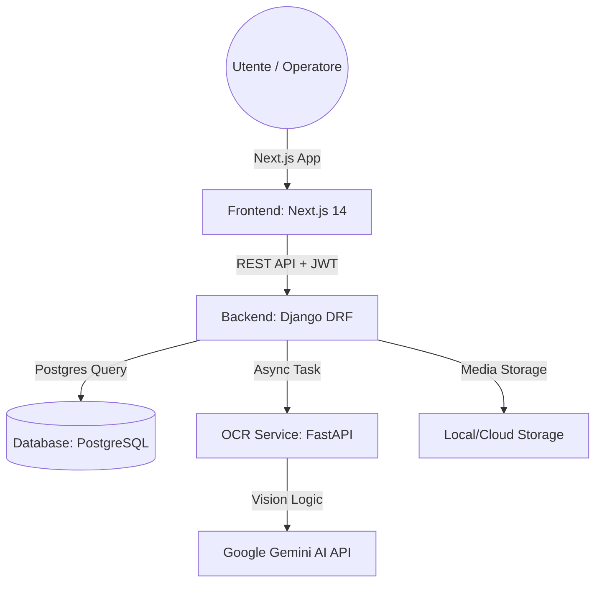

# 🚀 DeepEx: Enterprise-Grade AI Identity Extraction Platform

DeepEx è una soluzione SaaS all'avanguardia progettata per automatizzare l'estrazione e la gestione dei dati dai documenti d'identità (CIE, Patente, Passaporto). Utilizzando modelli di visione artificiale di ultima generazione (**Google Gemini 1.5 Flash**), la piattaforma trasforma immagini grezze in dati strutturati con precisione chirurgica.

---

## 🏗️ Architettura del Sistema (Microservizi)

La piattaforma è costruita su un'architettura a **microservizi disaccoppiati**, garantendo scalabilità orizzontale e manutenibilità. Ogni componente gira nel proprio container Docker.



### 🧠 Dettaglio Componenti
1.  **Frontend (Next.js 14 + Tailwind 4):** 
    - L'interfaccia utilizza un design **High-Density** per massimizzare l'efficienza degli operatori.
    - Utilizza **NextAuth.js** per la gestione delle sessioni sicure.
    - Implementa **Server Action** e **Client Components** per un bilanciamento perfetto tra SEO e interattività.
2.  **Core Backend (Django Framework):** 
    - Funge da orchestratore centrale. 
    - Gestisce la sicurezza (JWT), le migrazioni del database e la validazione dei dati.
    - Include un sistema di **Django Signals** (Zero-Waste) che pulisce automaticamente i file media eliminati per evitare sprechi di storage.
3.  **OCR AI Engine (FastAPI):** 
    - Un microservizio estremamente leggero e veloce dedicato esclusivamente all'integrazione AI.
    - Utilizza **FastAPI** per gestire chiamate asincrone e ridurre al minimo la latenza durante l'analisi delle immagini.
4.  **Persistence Layer (PostgreSQL):** 
    - Database relazionale solido per la conservazione di record utenti e metadati dei documenti.

---

## ✨ Funzionalità Principali

### 📤 Centro di Caricamento Avanzato
- **Live Image Preview:** Visualizzazione istantanea del documento caricato tramite `URL.createObjectURL`.
- **Scanning Lock:** L'interfaccia inibisce azioni multiple durante il processamento AI, garantendo l'integrità del flusso di lavoro.

### 🗃️ Vault Documentale (Archivio)
- **High-Density Data Tables:** Viste compatte che permettono di visualizzare centinaia di record in una singola schermata.
- **Status Badges:** Indicatori cromatici istantanei sulla validità dei documenti e sullo stato della scansione.

### 👮 Console di Amministrazione (Radar Control)
- **User Management:** Monitoraggio totale degli operatori registrati.
- **Deep Inspection:** Possibilità per l'Admin di "entrare" nell'archivio di ogni utente per verificare la conformità dei documenti caricati.

### 📄 Analisi Dettaglio
- **Side-by-Side Review:** Confronto visivo tra l'immagine originale e i dati estratti dall'IA su un'unica schermata divisa.

---

## 🛠️ Guida all'Installazione e Setup

### 1. Prerequisiti
- Docker & Docker Compose installati sul proprio OS.

### 2. Configurazione Variabili d'Ambiente
Il progetto usa un file `.env` nella root per gestire tutti i segreti. Docker Compose lo legge automaticamente.

1.  **Copia il template:** Duplica il file `env.template` e rinominalo `.env`:
    ```bash
    cp env.template .env
    ```
2.  **Inserisci i tuoi valori:** Apri il file `.env` appena creato e compila i campi richiesti:

    | Variabile | Dove trovarla | Obbligatoria |
    |---|---|---|
    | `GEMINI_API_KEY` | [Google AI Studio](https://aistudio.google.com/) | ✅ Sì |
    | `DJANGO_SECRET_KEY` | Genera un valore casuale sicuro | ✅ Sì in produzione |
    | `NEXTAUTH_SECRET` | Qualsiasi stringa lunga e casuale | ✅ Sì in produzione |
    | `POSTGRES_PASSWORD` | Lascia `postgres` per sviluppo locale | ⚠️ Cambia in produzione |

3.  Il file `docker-compose.yml` leggerà automaticamente tutte le variabili dal file `.env`.

> ⚠️ **Non caricare mai il file `.env` su GitHub.** È già escluso dal `.gitignore` del progetto.


### 3. Avvio
Esegui il comando per compilare e avviare tutti i servizi:
```bash
docker-compose up --build
```

### 4. Creazione Account Admin (prima volta)
Con i container attivi, apri un secondo terminale ed esegui:
```bash
docker-compose exec backend python manage.py createsuperuser
```
Segui le istruzioni per impostare email e password dell'amministratore.
Questo account ti permetterà di accedere alla **Console di Amministrazione** e gestire tutti gli utenti.

### 5. Accesso alla Piattaforma
- **Pannello Utente:** [http://localhost:3000](http://localhost:3000)
- **API Backend:** [http://localhost:8000](http://localhost:8000)
- **Interfaccia OCR:** [http://localhost:8001](http://localhost:8001)

---

## 📂 Struttura del Progetto

```text
ocr_project/
├── backend/            # Django Core (Modelli, API, Auth)
│   ├── api/            # Logica dei Documenti e Admin
│   └── core/           # Impostazioni di sistema
├── frontend/           # Next.js 14 App (Interfaccia Utente)
│   ├── src/app/        # Rotte (Dashboard, Admin, Auth)
│   └── src/components/ # Componenti UI riutilizzabili
├── ocr_service/        # FastAPI Service (Gemini AI Integration)
└── README.md           # Questa documentazione
```

---

## 🛡️ Sicurezza e Protezione Dati
- **Isolamento JWT:** Ogni utente può accedere esclusivamente ai propri documenti.
- **Admin Sharding:** Solo gli operatori con flag `is_staff` possono accedere alla console di amministrazione.
- **Cleanup Automatico:** Quando elimini un documento, il file fisico viene rimosso dal server per rispettare la privacy e ottimizzare le risorse.

---
*Manuale Tecnico Aggiornato al 30 Marzo 2026*
